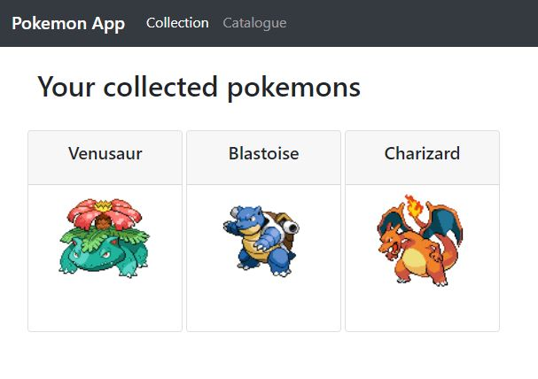

# Pokemon Trainer
This is a Pokemon "trainer" application built with Angular.

The application is deployed on Heroku https://pokemon-trainer-angular.herokuapp.com/

The pokemon data is provided by [The RESTful Pokémon API.](https://pokeapi.co/)

This project was generated with [Angular CLI](https://github.com/angular/angular-cli) version 11.0.1.

## How to use

User inputs his name on register page and can start collecting pokemons.

Catalogue page contains pokemons that can be collected.

When the user clicks a pokemon card, a detail page is presented with the option to collect the pokemon.

## Development server

Run `ng serve` for a dev server. Navigate to `http://localhost:4200/`. The app will automatically reload if you change any of the source files.

## Code scaffolding

Run `ng generate component component-name` to generate a new component. You can also use `ng generate directive|pipe|service|class|guard|interface|enum|module`.

## Build

Run `ng build` to build the project. The build artifacts will be stored in the `dist/` directory. Use the `--prod` flag for a production build.

## Running unit tests

Run `ng test` to execute the unit tests via [Karma](https://karma-runner.github.io).

## Running end-to-end tests

Run `ng e2e` to execute the end-to-end tests via [Protractor](http://www.protractortest.org/).

## Further help

To get more help on the Angular CLI use `ng help` or go check out the [Angular CLI Overview and Command Reference](https://angular.io/cli) page.

### Created by

[Christopher Berglund](https://github.com/cberg9) [Jesper Englund](https://github.com/englundjesper) [Emil Oja](https://github.com/xtrmil)
